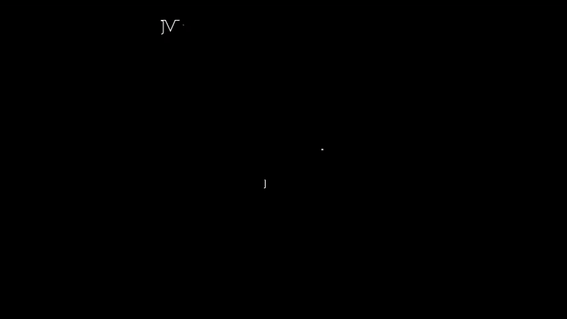

# DeepSeek-V3 Architecture

In this project, I have recreated the Deepseek v3 architecture. In one of my previous project, I have created Smollm2 architecture. In this project, I have modified that architecture by adding MHLA (MultiHead Latent Attention), Mixture of Experts (MoE) with Loss-less load balancing to recreate DeepSeek v3 architecture.


## Training Details

- Dataset: Cosmopedia dataset

- Training steps: 10,000

- Model Parameters: 348,089,144

- Model Configuration:

  ```python
  vocab_size = 49152
  hidden_size = 768
  num_hidden_layers = 8
  num_heads = 8
  intermediate_size = 1536
  max_seq_length = 2048
  compression ratio = 8
  num_experts = 8
  num_shared_experts = 1
  top_k_experts = 2
  ```

  

### Training Logs

```
step 9500 | loss: 5.1068 | dt: 205.39ms | tok/sec: 3852.88
GPU Memory: 5.86GB / 6.04GB

step 9550 | loss: 4.0633 | dt: 173.45ms | tok/sec: 3934.90
GPU Memory: 5.48GB / 5.51GB

step 9600 | loss: 4.8030 | dt: 178.11ms | tok/sec: 4142.49
GPU Memory: 5.58GB / 5.62GB

step 9650 | loss: 4.4450 | dt: 173.44ms | tok/sec: 4030.17
GPU Memory: 5.29GB / 5.36GB

step 9700 | loss: 4.0842 | dt: 177.04ms | tok/sec: 4275.76
GPU Memory: 5.42GB / 5.45GB

step 9750 | loss: 4.2598 | dt: 239.85ms | tok/sec: 3955.86
GPU Memory: 5.19GB / 5.28GB

step 9800 | loss: 4.2879 | dt: 162.08ms | tok/sec: 4308.44
GPU Memory: 5.01GB / 5.18GB

step 9850 | loss: 5.1025 | dt: 175.22ms | tok/sec: 4155.82
GPU Memory: 5.52GB / 5.57GB

step 9900 | loss: 4.5045 | dt: 187.34ms | tok/sec: 3960.34
GPU Memory: 5.37GB / 5.48GB

step 9950 | loss: 5.2817 | dt: 171.27ms | tok/sec: 3936.73
GPU Memory: 5.25GB / 5.33GB

Validation - loss: 4.7128 | dt: 179.87ms
```


### Sample Output

```
Prompt: Once upon a time
Generated: Once upon a time, in a small town named Harmonyville, lived two best friends - Timmy the Mr. Johnson, Timmy the Turtle, the Tortoise, the professor, and Benny the Scientist, they decided to share their thoughts with the park. One day, they heard some exciting news!

Curious about all the different stories they met "I'm one of a little town. When they entered, they could visit the park to watch new things like where they come from all the animals they would get better and better
--------------------------------------------------

Prompt: The future of artificial intelligence
Generated: The future of artificial intelligence, a special tool that provides an in high-quality design, and converting it into manageable parts. This is characterized by its high vision of a suitable area of materials available to a set of advantages and limitations. It is used to apply this method to play in the field of online gaming. By the end of this unit, you will be able to optimize this new language.

### Step 1: Understanding Your Body

To begin exploring the basics of BHS, let's first understand
--------------------------------------------------

Prompt: In the distant galaxy
Generated: In the distant galaxy, the bustling city of Stell, the U. Captain was always eager to become a prominent figure, who had been passionate about his friendship with a place in Canada. He had been the first few years, but she couldn't help but think about all the world around him.

"Hey, what do you know?" asked Polly. "The rhythm of the Way of Post-Just like many people because people can't want them to meet. One day, they shared a crucial role in
--------------------------------------------------

Prompt: He was walking
Generated: He was walking on a journey. It was a new way of saying, "What do you do?." It would be pretty cool, right? It's all about going on!

Max looked at the middle of the West"I've learned about "What do people do today?" she asked, "Well, why do people talk about different ways to use physical activities, which are important for everyone to wear and talk to others, even when they go away or try out with them to understand your emotions
--------------------------------------------------

Prompt: Music is a
Generated: Music is a fundamental aspect of a system. It provides an image with a wide range of data, which are a type of numbers that creates a range of times, which is known as the "tune behavior." This is a type of activity that allows us to understand a lot, shape, and texture and shape, shape and shape. It allows us to determine how a signal is applied to measure the effect of the image.

Let's start with the concept of an example. Imagine you want to know that
```


---


## MultiHead Latent Attention



 																							[Source](https://planetbanatt.net/articles/mla.html)

- Starting with MultiHeadLatentAttention. Looking at the class, it initializes with a `hidden size, number of heads, and compression ratio`. The `latent_dim` is hidden_size(embedding dimension) divided by compression_ratio, which suggests compressing the key and value projections. 
  There are two sets of projections: 

  - `kv_proj_d` and `q_proj_d` for compression, 
  - `k_proj_u`, `q_proj_u`, `v_proj_u` for decompression. 

  The RoPE (Rotary Positional Embedding) components are applied to parts of the queries and keys.

- In the forward method, the input `x` is projected into compressed KV and Q vectors. 

- Then decompressed into smaller dimensions. 

- The RoPE is applied to specific parts of the queries and keys. 

- The projected parts are contatenated with the RoPE-processed parts, which might be a way to maintain positional information while reducing computation. 

- Then scaled dot-product attention is used as usual. So this attention mechanism is different because it compresses the dimensions before computing attention, which could reduce memory usage and computation cost compared to traditional attention that uses the full hidden size everywhere.


## Mixture of Experts (MoE)


- The DeepSeekMoE class has shared experts and routed experts. The router decides which experts to use for each token. 
- The forward function calculates routing scores, selects top-k experts, and combines their outputs. The update_bias_terms method adjusts the routing biases based on expert load, which probably helps balance expert usage.
- In traditional MoE, all experts are routed, but here they are split between shared and routed experts. 
- Shared experts are always used, which might capture common patterns, while routed experts handle specialized cases. 
- The top-k selection is done per token, allowing dynamic routing. The bias update mechanism is interesting—it adjusts based on how much each expert is used compared to a target, which could prevent some experts from being underutilized.


## Traditional vs DeepSeek

Comparing to traditional transformers: The attention in DeepSeek uses compression and decomposed projections, which makes it more efficient. The MoE adds a mixture of shared and specialized experts with adaptive routing, whereas standard transformers use dense feed-forward networks. Together, these changes likely improve efficiency (less computation in attention) and effectiveness (better handling of diverse tokens via MoE).

1. **MultiHeadLatentAttention (Different from Standard Attention):**

   - Key Innovation: Uses compressed "latent" representations to reduce computation
   - How it Works:
     - Compresses Keys/Values using kv_proj_d (down-projection)
     - Compresses Queries using q_proj_d
     - Then decompresses them using _proj_u layers
     - Combines compressed representations with rotary positional embeddings (RoPE)
     - Uses standard scaled dot-product attention on the final representations
   - Why Better? Reduces memory usage and computation by working with compressed representations while maintaining positional awareness through RoPE

2. **Mixture of Experts (DeepSeekMoE):**

   - Key Innovation: Hybrid expert system with shared + routed experts
   - Structure:
     - Shared Experts (1 in this code): Always active, process all inputs
     - Routed Experts (2 in this code): Specialized experts selected per-token
     - Smart Routing: Uses learned biases and sigmoid activation to select experts

   - Key Differences from Traditional MoE:
     - Maintains shared experts as "base knowledge" while routed experts handle specialized patterns
     - Uses bias terms that adapt based on expert utilization (update_bias_terms method)
     - Combines outputs from shared and routed experts instead of using MoE exclusively

3. **Overall Architecture Differences from Traditional Transformers:**

   - Memory Efficiency: Latent attention reduces KV cache size through compression
   - Compute Efficiency: Processes most operations in compressed latent space
   - Expert Specialization: Hybrid expert system allows both general and specialized processing
   - Dynamic Adaptation: Router biases automatically adjust to balance expert usage


### Core Architecture Changes

| Component           | Traditional Implementation | DeepSeek Implementation             |
| ------------------- | -------------------------- | ----------------------------------- |
| Attention Mechanism | Standard Self-Attention    | MultiHeadLatentAttention            |
| MLP                 | Dense FFN                  | DeepSeekMoE Hybrid Experts          |
| Positional Encoding | Learned Embeddings         | Rotary Positional Embeddings (RoPE) |
| Normalization       | LayerNorm                  | LlamaRMSNorm                        |


### Architecture Summary

```bash
Input
│
├─ Rotary Position Embeddings
│
├─ Latent Attention (8:1 KV compression)
│  └─ RoPE-enhanced Q/K projections
│
├─ Hybrid MoE FFN
│  ├─ 1 Shared Experts (process all tokens)
│  └─ 7 Routed Experts (top-2 selection)
│     └─ Adaptive Load Balancing
│
└─ RMSNorm Residual Connections
```


This implementation captures DeepSeek's key innovations:

1. Memory-efficient attention through latent projections

2. Stable MoE training via shared experts + adaptive routing

3. Hardware-aware optimizations (compression, expert parallelism)

4. Dynamic load balancing of specialized experts


---


